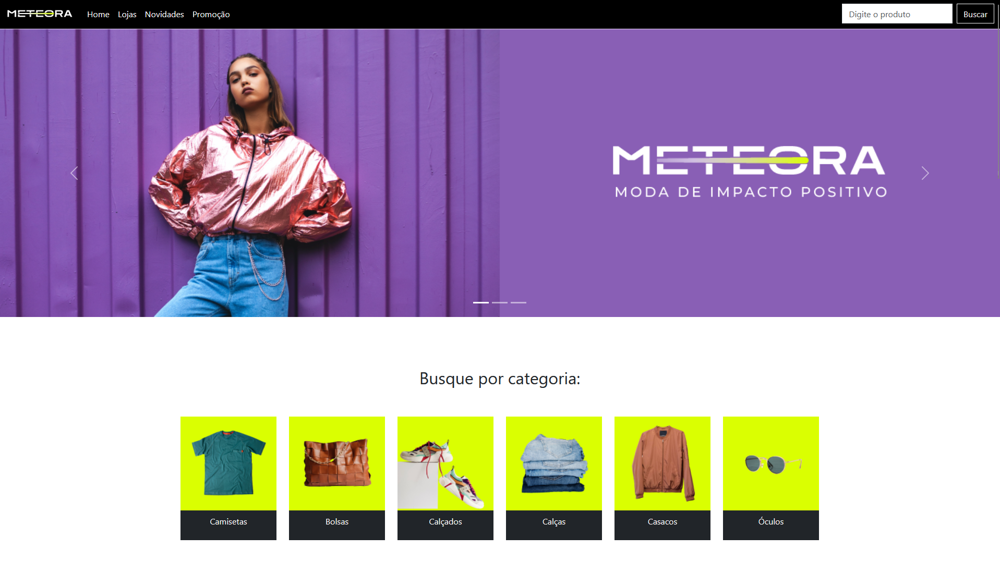

# Alura - Meteora
Projeto do curso da alura _"Bootstrap5: crie uma landing page responsiva"_, que cria uma web store fictícia usando elementos de bootstrap 5.3.0

### Autor
[Demócrito d'Anunciação](https://github.com/democrito88)